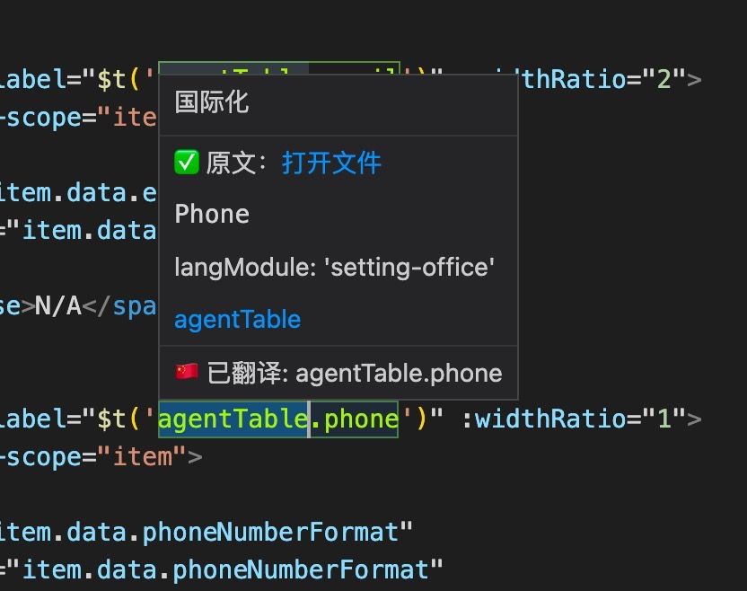

# 国际化辅助工具插件

该项目是一个用于国际化辅助的 VS Code 插件，旨在帮助开发者在代码中查找和处理中文文本，并将其转换为国际化格式。插件提供了多种功能，包括查找中文文本、忽略特定文本、设置模块 ID 以及替换选中的文本为国际化格式。

## 项目结构
- **src/**: 包含插件的源代码
  - **core/**: 核心功能模块
    - `CheckWord.ts`: 实现了查找和标记中文文本的功能
    - `Command.ts`: 注册和处理插件命令
    - `Constant.ts`: 定义了插件使用的常量
    - `FindWord.ts`: 实现了在不同文件类型中查找中文文本的功能
    - `LocalDicData.ts`: 处理本地国际化字典数据
    - `utils.ts`: 工具函数
    - `WordHoverProvider.ts`: 实现了鼠标悬停时显示国际化信息的功能
  - `extension.ts`: 插件的入口文件，负责激活插件并注册命令和事件监听器
- **test/**: 包含插件的测试代码
  - `runTest.ts`: 运行测试的入口文件
  - **suite/**: 测试套件
    - `extension.test.ts`: 示例测试文件
    - `index.ts`: 测试套件的入口文件
- **.vscode/**: VS Code 配置文件
  - `tasks.json`: 定义了构建和测试任务
  - `launch.json`: 定义了调试配置
  - `settings.json`: 自定义设置
  - `extensions.json`: 推荐的扩展列表
- **imgs/**: 存放项目相关图片
  - `1.jpg`: 效果展示图片
- **其他文件**:
  - `package.json`: 项目的配置文件，定义了插件的元数据、依赖和脚本
  - `tsconfig.json`: TypeScript 配置文件
  - `webpack.config.js`: Webpack 配置文件
  - `README.md`: 项目的说明文档
  - `CHANGELOG.md`: 项目的变更日志

## 功能
- 查找并标记代码中的中文文本
- 忽略特定的中文文本
- 设置文件对应的模块 ID
- 替换选中的文本为国际化格式
- 鼠标悬停时显示国际化信息

## 使用方法
1. 安装插件并在 VS Code 中启用
2. 使用插件提供的命令进行国际化处理
3. 在代码中查找和替换中文文本为国际化格式

## 效果展示

Usage: vsce <command>

Options:
  -V, --version                      output the version number
  -h, --help                         display help for command

Commands:
  ls [options]                       Lists all the files that will be published
  package [options] [version]        Packages an extension
  publish [options] [version]        Publishes an extension
  unpublish [options] [extensionid]  Unpublishes an extension. Example extension id: microsoft.csharp.        
  ls-publishers                      List all known publishers
  delete-publisher <publisher>       Deletes a publisher
  login <publisher>                  Add a publisher to the known publishers list
  logout <publisher>                 Remove a publisher from the known publishers list
  verify-pat [options] [publisher]   Verify if the Personal Access Token has publish rights for the publisher.
  show [options] <extensionid>       Show extension metadata
  search [options] <text>            search extension gallery
  help [command]                     display help for command